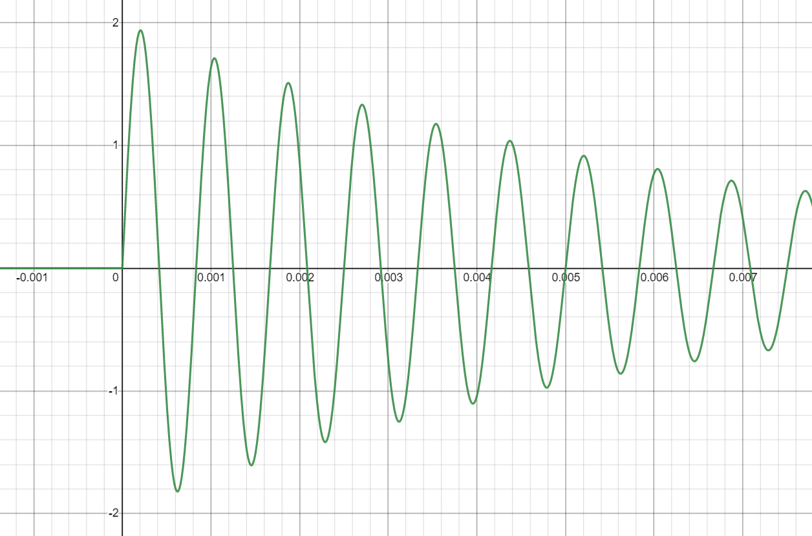
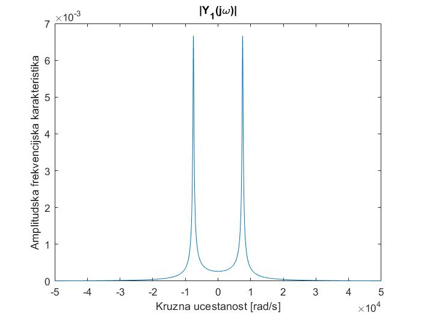
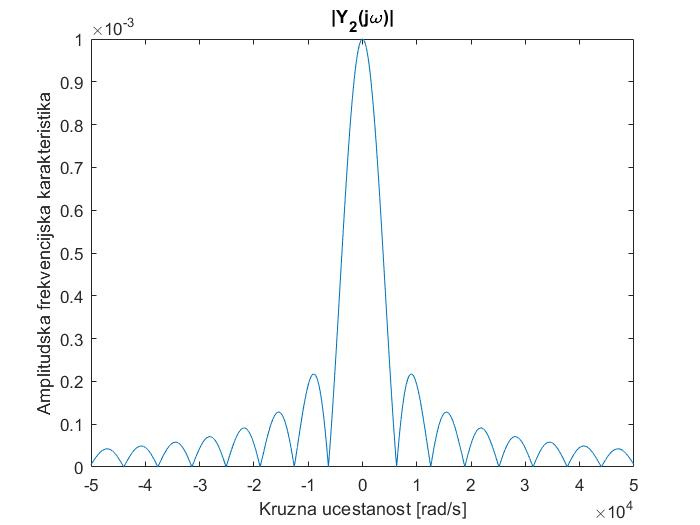

# frequency-division-multiplexing
Independent parallel transmission of two signals through a common communication channel modeled in MATLAB, using low-pass filters, band-pass filters, and amplitude modulation.

Homework/project in **Signals and Systems (13E052SISR)** at the University of Belgrade, School of Electrical Engineering.

## Signals (example)

Signal y<sub>1</sub>(t) is transmitted in the primary frequency range, and the signal y<sub>2</sub>(t) is moved to the next frequency channel, i.e. the amplitude
is modulated by the frequency carrier f<sub>c</sub>.

### Signal 1

Original signal: 
```
y1(t) = 2 * sin(2400*pi*t) * exp(-150t) * heaviside(t)
```


Signal spectrum is analytically determined:
```
Y1(jw) = 4800pi / ((2400pi)^2 + (150+jw)^2))
```

The amplitude characteristic can be found below:


### Signal 2

Original signal:
```
y2(t) = heaviside(t-0.001) - heaviside(t-0.002)
```


Signal spectrum is analytically determined:
```
Y2(jw) = 0.001 * exp(-0.0015jw) * sinc(0.0005w)
```

The amplitude characteristic can be found below:


### Result

The bandwidth is divided into two non-overlapping frequency bands, each of which is used to carry a separate signal. Both signals smoothed using low-pass filters, the second signal is modulated, and finally the superposed transmission signal is formed:

